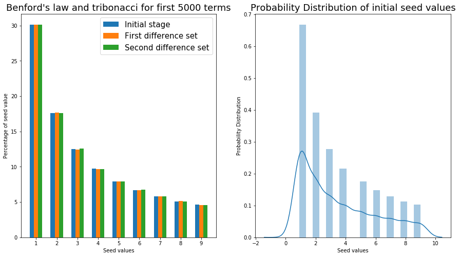

# Benford-Conjucture
* Most of the naturally occuring data sets follows Benfords Law and results in a similar pattern of plot all time
* The Tribonacci series is also one of those naturally occuring data set
* This repository contains the verification of Benfords Conjucture plotting with Tribonacci series

> **_NOTE:_**  This specific code not just verifies the Benfords Conjecture for Initial Tribonacci series, but also very for **SUCCESSIVE DIFFERENCE SERIES** for 3 iterations

# Inputs
* The program get the input of number of elements of tribonacci series till which the graph must be plotted
* **Number of terms ∝ The accuracy of Benford Conjucture Curve**

# Outputs
* The plot of 3 successive set difference is compared in a same bar plot.
* The initial set with no set difference is given a distribution plot to show the decreasing nature of the curve according to benfords law 
* The pattern proves that even for n number of successive difference iterations, the Benford Conjucture still holds true, provided we have a large dataset (i.e, More number of terms)
## Below is the example of a sample plot for **NUMBER OF TERMS = 5000** 

# Benfords Law and its probability distribution reference

https://mathworld.wolfram.com/BenfordsLaw.html
